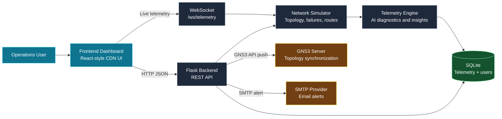

# Network Digital Twin Architecture

## System Overview

## Components

| Component | Responsibility |
|---|---|
| Frontend | Login, topology visualization, telemetry charts, AI Copilot, failure controls |
| Flask backend | REST APIs, authentication, RBAC, topology operations, exports |
| WebSocket | Pushes live topology, telemetry, incidents, and AI diagnostics |
| Network simulator | Maintains nodes and links, failures, latency, packet loss, routing, and traffic |
| Telemetry engine | Produces health scores, SLA diagnostics, forecasting, and recommendations |
| SQLite | Stores telemetry history and persistent user accounts with password hashes |
| GNS3 integration | Pushes configured nodes and links to a GNS3 project through the v2 API |
| SMTP provider | Sends operational email alerts when SMTP settings are configured |

## Runtime Flows

### Live Telemetry

1. The frontend authenticates through the Flask login API.
2. The browser opens `/ws/telemetry`.
3. The simulator advances telemetry every two seconds.
4. The backend sends topology, health, incidents, and AI diagnostics over WebSocket.
5. The frontend updates the canvas and charts without a page reload.
6. If WebSocket is unavailable, the frontend falls back to HTTP polling.

### Failure and Reroute

1. An operator injects a failure through the REST API.
2. The simulator marks the node or link and recalculates routing tables.
3. Auto Reroute uses latency, loss, bandwidth, and utilization as route costs.
4. The updated path is displayed on the topology canvas.

### External Synchronization

1. An administrator configures `GNS3_SERVER_URL` and `GNS3_PROJECT_ID`.
2. The backend creates GNS3 nodes and maps their returned IDs.
3. The backend creates links using the mapped GNS3 node IDs.
4. Without GNS3 configuration, the endpoint returns a safe sync preview.
