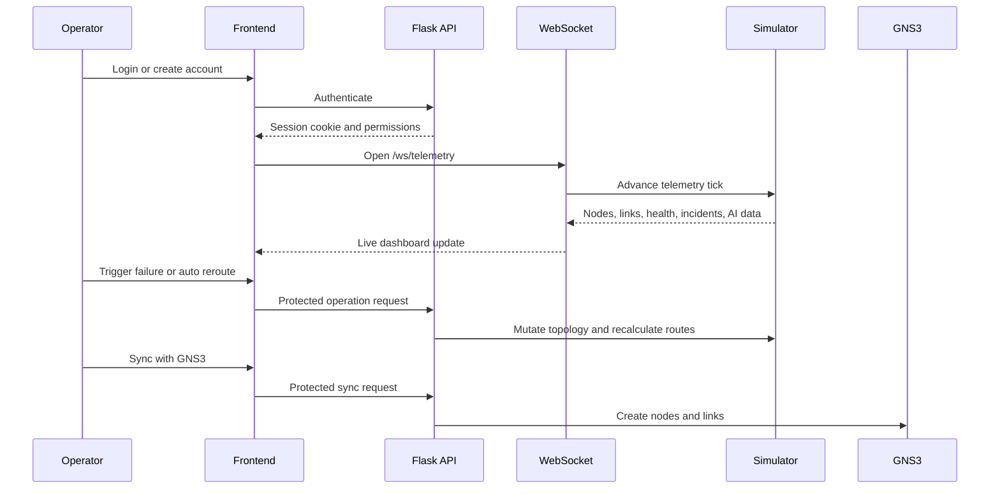

# Network Digital Twin Integration Demo

This flow demonstrates the main integrated operations workflow from authentication to topology synchronization.

## Start the Application

From the repository root:

```powershell
python app.py
```

Open `http://localhost:5000`.

## 1. Login

Use one of the built-in demo accounts:

| Username | Password | Role |
|---|---|---|
| `admin` | `admin123` | Full administration |
| `operator` | `operator123` | Simulation and optimization |
| `viewer` | `viewer123` | Read-only monitoring |

The backend sets an HTTP-only session cookie. Protected APIs reject requests without a valid session.

## 2. Create Account

Click **Create account** on the login screen. New users can select:

- `viewer` for read-only access
- `operator` for simulation, export, and rerouting access

Accounts are stored in SQLite with password hashes and remain available after a server restart.

## 3. Failure Simulation

1. Sign in as `operator` or `admin`.
2. Open the **What-If** tab.
3. Use **Cut Primary Link**, **Crash Core Node**, **DDoS Flood**, or **Latency Spike**.
4. Observe node/link status, incident feed, health score, and live telemetry changes.

API example:

```http
POST /api/simulate/failure
Content-Type: application/json

{
  "type": "ddos_attack",
  "target_id": "r1"
}
```

## 4. AI Copilot

Click **AI Copilot** to open live operational intelligence:

- SLA anomalies
- Failure forecast
- Network risk score
- Configuration drift
- Capacity upgrade recommendations
- Automated remediation actions

The Copilot refreshes every three seconds while open and also receives diagnostics through WebSocket telemetry.

## 5. Auto Reroute

1. Open **What-If**.
2. Select a source and destination node.
3. Click **Auto Reroute Around Congestion**.
4. The route optimizer evaluates latency, packet loss, bandwidth, and utilization.
5. The canvas highlights the selected route and reports whether traffic was rerouted.

API example:

```http
POST /api/advanced/route-optimize
Content-Type: application/json

{
  "source": "r1",
  "target": "srv2"
}
```

## 6. GNS3 Sync

Configure an existing GNS3 project before starting the backend:

```powershell
$env:GNS3_SERVER_URL="http://127.0.0.1:3080"
$env:GNS3_PROJECT_ID="your-project-id"
$env:GNS3_AUTH_TOKEN="optional-token"
python app.py
```

Then open the **Advanced** tab and run GNS3 synchronization. The backend creates the digital twin nodes and links through the GNS3 v2 API.

Without GNS3 settings, the same operation returns a safe preview payload instead of making an external request.

API example:

```http
POST /api/gns3/sync
```

## Realtime Integration



## Recovery

Use **Heal All** after the demo to restore node status, link status, latency, and packet loss to a healthy baseline.
